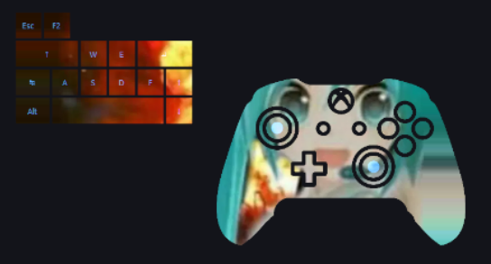

# coreBoard

**Keyboard, mouse, and controller overlay for streamers.** Show every key press, mouse move, and gamepad input on screen in real time—and design fully custom layouts with a built-in editor. Full **NohBoard** compatibility.

[](LICENSE) [](https://github.com/RandomTick/coreBoard/releases)

---

## Preview

<p align="center">
  
</p>

---

## What is coreBoard?

An **on-screen input overlay** for streaming, speedrunning, or recording. Viewers see exactly what you press and how you move—keyboard, mouse, and gamepad. Capture the **View** tab in OBS, Streamlabs, or similar tools.

- **Full input support** — Keyboard, mouse buttons, mouse speed, and gamepad (buttons, sticks, triggers).
- **NohBoard compatible** — Use existing `.json` layouts as-is. No conversion.
- **Built-in editor** — Create and tweak layouts without leaving the app.
- **Highly customizable** — Per-key colors and fonts, global theme colors, shapes, labels, and more.

> **Security:** The app receives keyboard (and optionally mouse/gamepad) input for visualization. Do not type passwords while it is visible. Use only in trusted setups.

---

## Input & overlay support

| Input | What’s shown |
|-------|----------------|
| **Keyboard** | Key press/release highlighting, Shift and Caps Lock–aware labels. |
| **Mouse** | Left/right/middle and extra buttons; optional **mouse speed indicator** (movement intensity). |
| **Gamepad** | All buttons (A, B, X, Y, bumpers, D-pad, sticks, Back, Start). **Analog sticks** as direction viewers. **Triggers** with fill level (LT/RT). Optional **full controller** overlay with editable button regions. |

Layouts can mix keys, mouse indicators, stick viewers, trigger fills, controller overlays, and **labels** (custom text, with optional shift variant). Everything is optional and customizable.

---

## Maximum customizability

coreBoard is built so you can match your stream’s look and show exactly what you want.

### Global appearance (View tab)

- **Colors** (Settings → Colors): key idle, key pressed (highlight), background, text, and pressed text. One theme for the whole overlay.
- **Label display** (Settings → Label display): **Follow Caps Lock and Shift**, **All uppercase**, or **All lowercase** for key labels.

### Per-key / per-element control (Edit Layout)

- **Edit style** (right‑click a key): per-key **idle** and **pressed** colors, **text** and **pressed text** colors, **font family** and **size**, **border** (width + color). Overrides global colors for that key.
- **Edit shape**: resize, **scale** (%), **rotate**, **text anchor** (position inside shape or center). For polygons: **add/remove vertices**, **polygon holes**, scale holes. Full control over shape and text placement.
- **Rebind**: attach any key code (keyboard or mouse) or multiple codes (OR logic) to a key. Rebind gamepad buttons and triggers to shapes.
- **Edit text**: change main and shift label for the key.

### Shapes and elements

- **Shapes:** Rectangle, Circle, Star, Diamond, Hexagon, Triangle, or **custom polygon** (with optional holes). Resize and edit vertices in the shape editor.
- **Special elements:** **Mouse speed indicator**, **Angular viewer** (left/right stick direction), **Controller** (full gamepad with editable regions), **Label** (standalone text).
- **Copy / paste & style:** Copy a key and paste elsewhere; **Pick style** then **Apply** to copy colors/font/border to other keys.

### Layout and format

- **NohBoard .json** — Load and save the same format. Use layouts in NohBoard or coreBoard. (coreBoard adds optional elements like stick viewers and controller overlays that NohBoard may ignore.)
- **Undo/Redo** — Full history for layout and shape edits.
- **Persistence** — Remembers last layout, recent files, view/editor tab, colors, and language.

### Language and UX

- **Languages** — English, Deutsch, Français (Settings → Language).
- **Help** — Getting started, NohBoard layouts, check for updates, report a problem.

---

## Features (summary)

- **Live overlay** — Real-time keyboard, mouse, and gamepad visualization (Windows).
- **Full keyboard** — Any key code, Shift/Caps aware labels.
- **Mouse** — Buttons + optional speed indicator.
- **Gamepad** — Buttons, sticks (angular viewer), triggers (analog fill), optional full controller overlay with editable regions.
- **Layout editor** — All shapes above; per-key style (colors, font, border); rebind; text anchor; copy/paste and pick/apply style.
- **Global theme** — Key, highlight, background, text colors; label mode (Caps/Shift, upper, lower).
- **NohBoard .json** — Load/save same format; switch between apps without conversion.
- **Undo/Redo** — Layout and shape edits.
- **Languages** — EN, DE, FR.

---

## Quick Start

**Windows:** Download the latest installer from [Releases](https://github.com/RandomTick/coreBoard/releases).

**From source** (CMake 3.5+, Qt 5 or 6 with Widgets + Svg + LinguistTools, C++17):

```bash
git clone https://github.com/RandomTick/coreBoard.git
cd coreBoard
cmake -B build -DCMAKE_PREFIX_PATH=<path-to-Qt>
cmake --build build
```

Run the executable from the project root (e.g. `build/CoreBoard.exe`).  
**View** = overlay to capture in OBS. **Edit Layout** = open, create, or edit layouts (including NohBoard `.json`).

**Project layout:** `src/` = application source; `docs/` = documentation and images; `translations/`, `icons/`, `installer/` = resources.

---

## Usage

| Action | Description |
|--------|-------------|
| **Open** | Load a `.json` layout (NohBoard format). |
| **New** | Start a blank layout. |
| **Add shape** | Add rectangle, circle, star, diamond, hexagon, triangle, or custom polygon. Or add Mouse speed indicator, Angular viewer (stick), Controller, or Label. Right‑click a key for Edit style, Edit shape, Rebind, Edit text, or Delete. |
| **Copy / Paste key** | Copy a key, then click where to paste. **Pick style** then **Apply** to copy appearance to other keys. |
| **Save / Save as** | Write layout to JSON (same format as NohBoard). |

---

## Switching from NohBoard?

Your layouts work as-is. See **[NohBoard Migration Guide](docs/NOHBOARD_MIGRATION.md)** for a short step-by-step.

---

## Contributing

Bug reports, feature ideas, and pull requests are welcome. Translation help (en/de/fr in `translations/`) is appreciated.

---

## License & Thanks

**coreBoard** is released under the [GNU General Public License v3.0](LICENSE).

Inspired by **NohBoard**. We aim for full layout compatibility while adding a built-in editor, keyboard + mouse + controller support, and maximum customizability.
